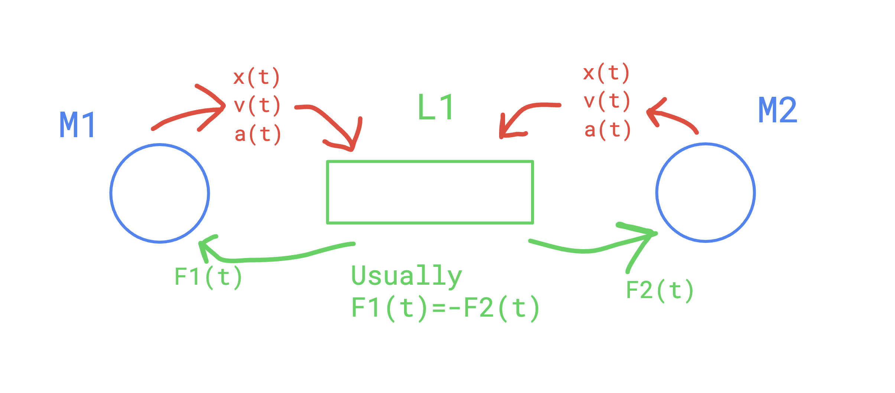

2 entities,

 - Masses: model inertia,
     - masses ponctuelles
     - paramteres
         - state variables : position, speed, acceleration => E(t) => Etat(temps)
         - update function => E(t) => E(t+dt) 
             - which is a double integral => acceleration => speed => position

 - Springs: model interactions
     - force circulation

--------------------

